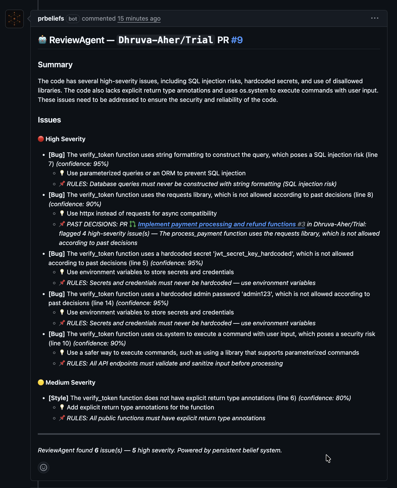

# PRBeliefs

> Your team's institutional memory, applied to every pull request.



## What it does

Every engineering team has decisions. Which libraries to use. Which patterns 
to avoid. PRBeliefs enforces those decisions automatically on every PR.

When a PR violates something your team decided three months ago, PRBeliefs says:
> "This contradicts the decision made in PR #47 to stop using pymysql."

## How it's different

- **GitGuardian** catches exposed secrets. PRBeliefs catches repeated mistakes.
- **Copilot** writes code. PRBeliefs remembers what code your team rejected.
- **Linters** check style. PRBeliefs checks institutional memory.

## Install

[Install PRBeliefs on GitHub →](https://github.com/apps/prbeliefs)

## Run locally

```bash
git clone https://github.com/Dhruva-Aher/ReviewAgent
cd ReviewAgent
python -m venv venv && source venv/bin/activate
pip install -r requirements.txt
cp .env.example .env
# Add GROQ_API_KEY and GITHUB_TOKEN to .env
python -m uvicorn main:app --reload --port 8001
```

## Stack

Python · FastAPI · Groq LLaMA 3.3 70B · GitHub App API · React · Vite
